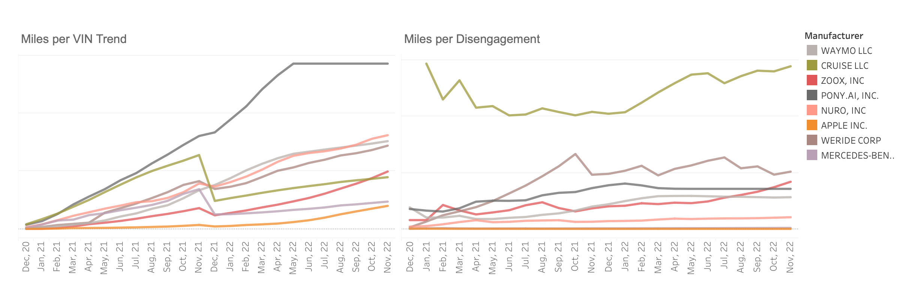
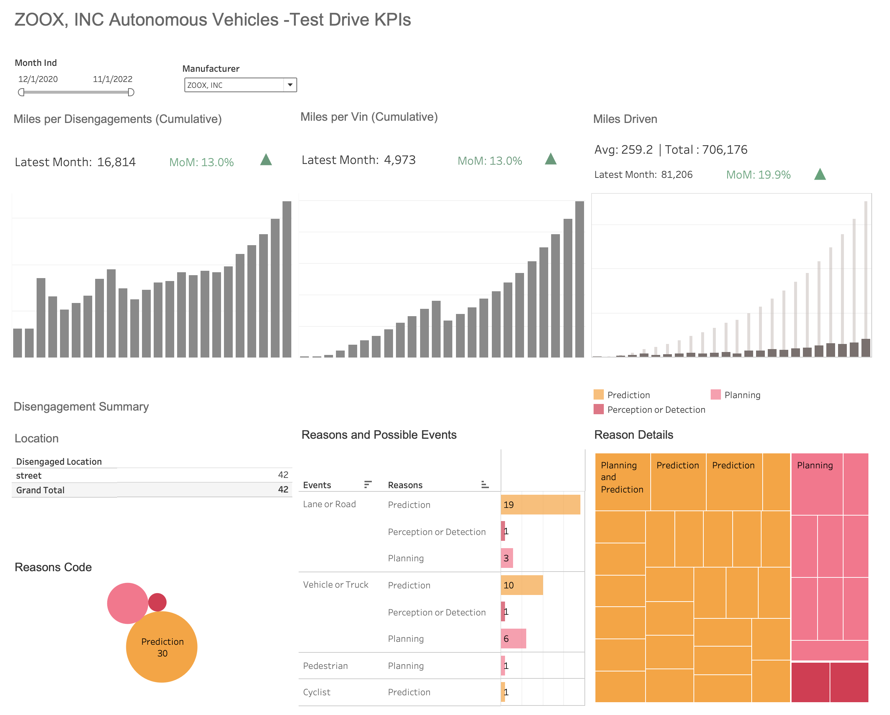
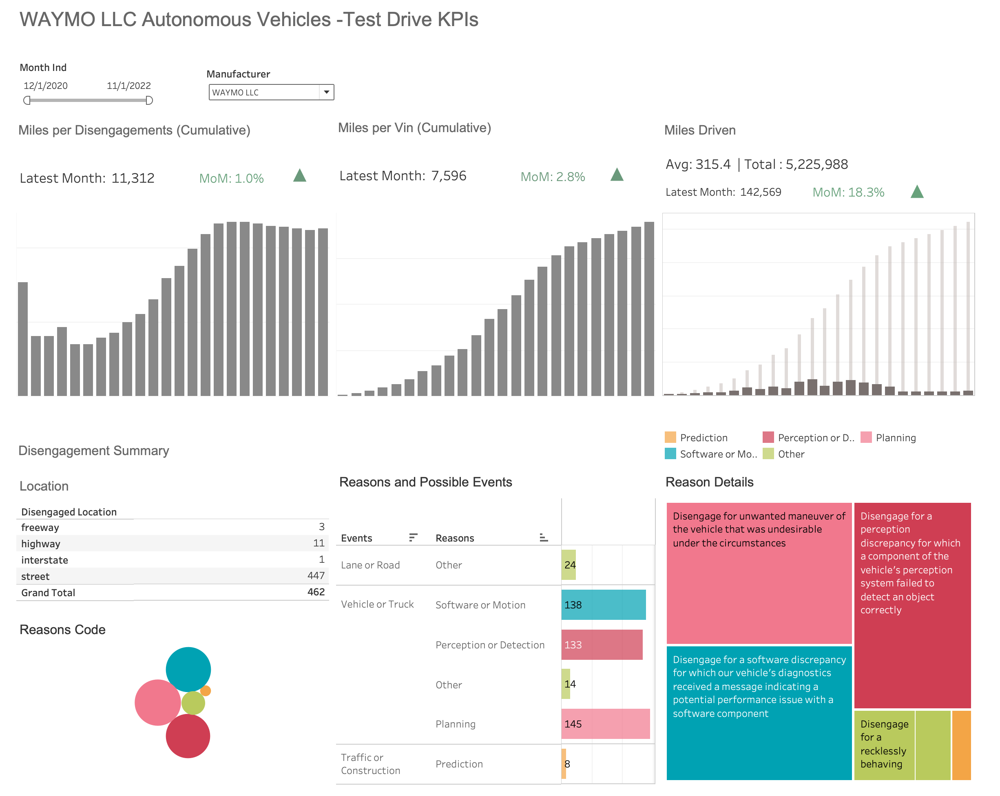

# Autonomous Driving Case-Study

## Objective
The main objective is to understand and measure the performance of the Zoox' autonomous vehicles test-drive operations and how they are doing against competitors. 

## Key Performance Indicators (KPIs)
For any autonomous vehicle test-drive, the more miles you test without any notable disruptions confirms the probability of success in the real world. Having said that and given the data we have, at first glance, it appears that the top level metrics should be:
- **Miles driven during the test drive** (more is better)
- **Number of disengagements during the test drive** (less is better)

**However**, these absolute metrics don't necessarily guarantee the benchmarking against competitors and don't provide meaningful insights while looking at metrics separately.
- The size of operations of the competitors' landscape is widely varied. The number of miles can just be a function of investment in the number of cars participating in the test drive.
- Individually, the number of disengagements can be just a function of miles driven even with proper solutions in place driven by newer possibilities not yet tested. 

**Therefore**, by looking at the objective and the context of study, we should track the following KPIs.

## Contextual KPIs

**1. Primary KPI:** (For Benchmarking)
- **Miles per vin :**  this indicates, given the amount of investment, we are driving sufficient miles to test all our features 
- **Miles per disengagement :** this indicates the quality of our system. The more miles we drive without disengagement, the more confident we are about the quality of performance of the system.

**2. Secondary KPI:** (For Internal Tracking)
- **Miles driven :** This is to ensure internally that we are gradually increasing our test miles, which are sufficient to test features and geographies we plan to expand. If we plan for any city or country for a given duration, we can always track this against the **targeted project miles to be driven**

## Analysis steps:
1. Exploratory data analysis (EDA)
2. Creating curated and reporting datasets and deriving fields from the source data 
3. Building a Tableau Dashboard
4. Generate insights

### 1. Exploratory Data Analysis:
- found some inconsistencies in data and plan for data curation
- Also, this analysis leads to data transformation and derived fields for reporting and analysis 
- **EDA code and results** are available in this file: [EDA_and_Reporting_Data_Pipeline.ipynb](./EDA_and_Reporting_Data_Pipeline.ipynb)

### 2. Creating curated and reporting datasets and deriving fields from the source data 
- perform data-curation to clean up the data
- create longitudinal data from dmv_mileage source data sets to make it fit for better reporting and analysis purposes
- Append and merge mileage and disengagement curated input data sources to
- Created a cumulative sum of key source metrics such as miles and disengagement per month and vin

- Performed **text analysis** with the business context in mind to determine disengagement **reasons' classification** and events triggered the disengagement. The possible high level reasons for disengagement are the **failure or errors** due to:
    - Perception or Detection  
    - Prediction
    - Planning
    - Hardware
    - Software or Motion
    - Mapping

- **Code for this section** is available here: [EDA_and_Reporting_Data_Pipeline.ipynb](./EDA_and_Reporting_Data_Pipeline.ipynb)

### 3. Building a Tableau Dashboard
- Think about how to present the metrics - relevant charts. For example, cumulative presentation of the primary KPIs above makes more sense as it reduces the period by period fluctuations and helps us understand overall we are improving the efficiency of operations. 
- Think about layouts and the number of charts and dashboards makes sense. For example, we 'benchmarking analysis' and Zoox's performance metric for disengagement reasons. Analyses are kept in two different dashboard views. 
- **Tableau Report** is available here : [zoox-case-study.twbx](./zoox-case-study.twbx)

### 4. Generate Insights

1.1 Overall, Zoox produces more **'miles per disengagement'** compared to the mean of competitors' but, it falls short in driving **'miles per vin'** compared to its key competitors except for 'Cruise, LLC', which is almost at the same level as Zoox:
   
   

1.2 Overall, zoox ranked **5th** w.r.t **'miles per vin'** in its competition. However, it did better w.r.t **'miles per disengagement'**, ranked **3rd**:

   
   
2. However, Zoox has done well in 2022 w.r.t both the KPI and improved. As for 2021, Zoox ranked **7th** (**'miles per vin'**) and **5th** (**'miles per disengagement'**) respectively against competition:

   
   
3. This is also evident from the cumulative trend charts below, which we see specifically from Jun'22, Zoox's performance in both the KPIs has got **significant upwards traction** compared to most of the competitors.

   
   
4. There is a sharp drop in **miles per vin** kpi from Nov 21 to Dec 21. The primary reason being 57 new vin were added, which resulted in the initial fewer miles collections across vin, which eventually started gaining traction

       

   
5.1. **The Main KPI view for Zoox:**

    

5.2 **The KPI view for a competitor:**

    
   

## Data Gaps and Desired Additional Information
- **Data gaps** :
    - Inconsistencies in the values of the categorical fields as explained previously in [EDA_and_Reporting_Data_Pipeline.ipynb](./EDA_and_Reporting_Data_Pipeline.ipynb)
    - Reason details are not consistent, makes it not straight forward to compare similarity and classify 
 
- **Additional Information** : Some of the additional **contextual** information would have been useful to find more **meaningful** insights and the **right** benchmarking 
    - Geographical information - which cities/counties
    - Weather conditions - windy, foggy, rainy, sunny etc.
    - Time of the day - day, night etc.
    - Traffic condition during the time of testing
    - What features are being tested - is there a similarity between competitors 
